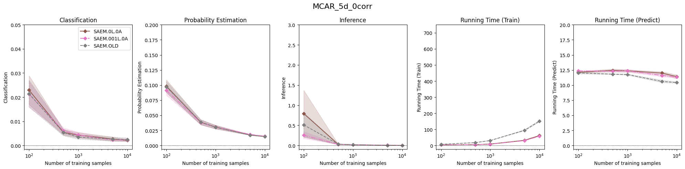
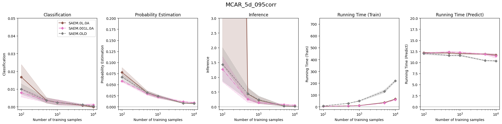
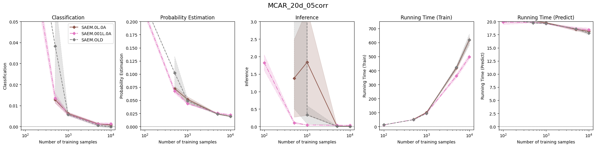

Results of:
* SAEM.OLD (implementation from [wijiang94](https://github.com/wjiang94/misaem))
* SAEM.0L.0A ([new implementation](https://github.com/ChristopheMuller/misaem), no regularization: lambda = 0, alpha = 0)
* SAEM.001.0A ([new implementation](https://github.com/ChristopheMuller/misaem), some small regularization: lambda = 0.01, alpha = =1=Ridge)

In term of stability:
* SAEM.OLD fails for small n when correlation is high or number of covariates is big
* SAEM.0L.0A fails sometimes but raise the right error (suggest to add regularisation)
* SAEM.001L.0A never fails

